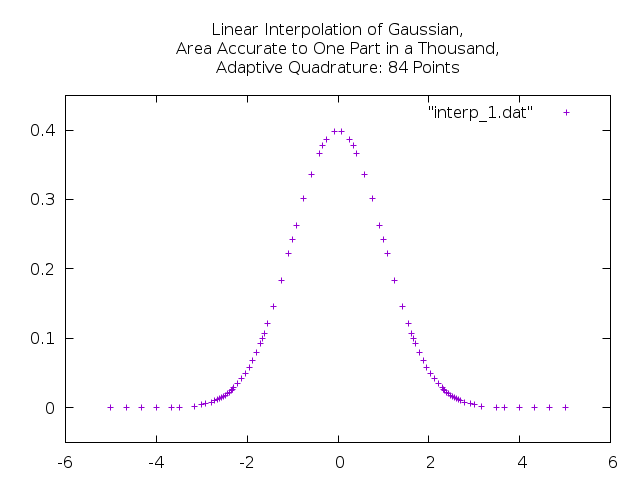

# numeric

## C++-11 library for numerical computation

The C++-11 numeric library provides physical units, an adaptive quadrature
integrator, and the ability to instantiate a linear interpolant in various,
convenient ways.

***[Visit the documentation site.](https://tevaughan.github.io/numeric/doxygen-html)***

## To do:

 - Incorporate and adapt code from my linear regression project on github.

## License

Copyright 2016
Thomas E. Vaughan

Distributable under the terms of the GNU LGPL, Version 3 or later.

