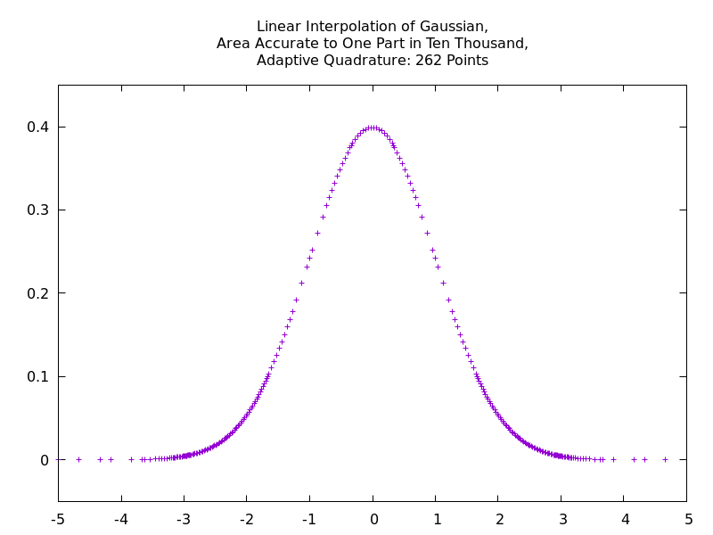

# numeric

## C++-11 library for numerical computation

The "numeric" project is a C++-11 library. It provides
- types that allow an expression's dimension to be determined at compile time
  ```cpp
  #include <iostream>
  #include <units.hpp>
  using namespace num;
  int main() {
     using time = num::time;  // in case of conflict with C library's time()
     length x0 = 2 * m;       // meters
     speed  v  = 5 * m / s;   // meters per second
     time   t  = 3 * min;     // minutes
     // Output distance in meters (the default) and in yards.
     std::cout << x0 + v * t << std::endl;                  // "[902 m]"
     std::cout << (x0 + v * t) / yd << " yd" << std::endl;  // "986.439 yd"
     return 0;
  }
  ```
- an adaptive-quadrature integrator
- an interpolant class with various, convenient constructors

The following plot shows, as an example, the result of constructing a linear
interpolant for a Gaussian.  One specifies a desired accuracy for the area of
the interpolant in comparison with that of the originl function.  The
constructor chooses the minimum number of points necessary to produce that
accuracy.  Notice that points are dense where the curvature is large.



## Documentation

***[Documentation can be viewed on the Github-Pages site for numeric.](https://tevaughan.github.io/numeric/doxygen-html)***

## To do:

 - Incorporate and adapt code from my linear regression project on github.

## License

Copyright 2016
Thomas E. Vaughan

Distributable under the terms of the GNU LGPL, Version 3 or later.

